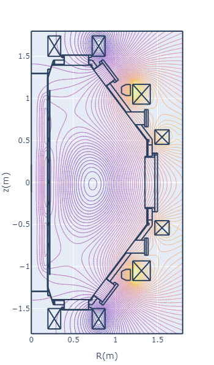

# Tokamak equilibrium code

We will develop a tokamak equilibrium calculation code.

[Equations of magnetics](doc/magnetics_en.md)

[Procedure of equilibrium calculation](doc/equilibrium_en.md)


## Getting started

"Plotly" is used to draw the graph. Therefore, **Node.js** must be installed in order to display the graph.

1. Clone this project using VS code etc.
1. Execute 'equalibrium.ipynb' in the root directory in order from the top.

## How to set calculation conditions
An example of the calculation conditions can be found in the conditions of'equilibrium.ipynb'.

```python:
condition = {
    # TF current
    'cur_tf':{'tf': 50.0e+3, 'turn': 16},
    
    # initial plasma profile
    'cur_ip':{'ip':-100.0e+3, 'r0':0.65, 'z0':0.0, 'radius':0.3},
    
    # PF currents
    'cur_pf':{'hcult16':0.0,'pf17t12':1.0e+3, 'pf26t18':1.0e+3,'pf4_1ab3_cc2':0.0,'pf35_2':0.0, },
    
    # number of coefficients
    'num_dpr':2, # dp/df
    'num_di2':2, # di2/df
    
    # calculate position of flux: 'fl_val'
    'fl_pos':{'flc8':(0.1985, 0.450), 'f_im':(0.1985, 0.0), 'flc17':(0.1985, -0.450),
              'fls1':(1.374, 0.450), 'fls5':(1.374, 0.0), 'fls9':(1.374, -0.481)},
    
    'resolution': gl.get_dmat_coarse(),
    }
```

Calculation conditions are described in python dictionary type.
Namely, 'parameter name':value, etc.

The specifiable PF coil name can be found in '/colis/data_npy/'.

## How to check the calculation result.
You can see what was calculated with '.keys ()'.

```python:
cond.keys()
```
```python:
dict_keys(['cur_tf', 'cur_ip', 'cur_pf', 'num_dpr', 'num_di2', 'fl_pos', 'resolution', 'vessel', 'flux_coil', 'jt', 'flux_jt', 'flux', 'ir_ax', 'iz_ax', 'r_ax', 'z_ax', 'conf_div', 'f_axis', 'f_surf', 'domain', 'error', 'param_dp', 'param_di2', 'iter', 'cal_result', 'pts', 'major_radius', 'minor_radius', 'elongation', 'triangularity', 'volume', 'cross_section', 'flux_normalized', 'fl_val', 'diff_pre', 'pressure', 'diff_i2', 'pol_current', 'pressure_vol_average', 'beta_toroidal', 'coef_toroidal_flux', 'safty_factor'])
```

jt: toroidal current. Note, current through one mesh.

ex. If total plasma current is set to 10, cond['jt']['matrix'] = 10.

flux_coil: magnetic flux due to PF coils.

flux_jt: magnetic flux due to plasma current

flux: total magnetic flux (flux_coil+flux_jt)


You can check the calculation result with contour map or heat map.

"Plotly" is used to draw the graph. Therefore, **Node.js** must be installed in order to display the graph.

```python:
import sub.plot as pl
pl.d_contour(cond['flux'])
```


```python:
import sub.plot as pl
pl.d_heatmap(cond['domain'])
```


We are accepting questions at any time.